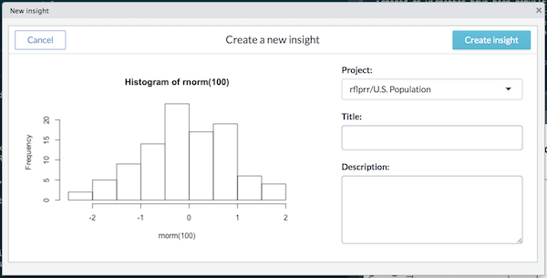

# data.world-r

[](https://circleci.com/gh/datadotworld/data.world-r)

The `data.world` package is the main R package for working with datasets 
on [data.world](https://data.world).  
Using this packages users can:

* Query and join datasets
* Choose between SQL and SPARQL
* Publish insights
* Use data.world's REST API (via included `dwapi` package)

# Getting Started

To get started, load the library and checkout the `quickstart` vignette.
```R
library(data.world)
vignette("quickstart", package = "data.world")
```

Here is a simple example:
```R
intro_ds <- "https://data.world/jonloyens/an-intro-to-dataworld-dataset"

sample_query <- data.world::qry_sql(paste0(
  "SELECT t.Name, t.Height, s.AssistsPerGame ",
  "FROM DataDotWorldBBallTeam as t ",
  "JOIN DataDotWorldBBallStats as s ON t.Name = s.Name ",
  "ORDER BY s.AssistsPerGame DESC"))

data.world::query(sample_query, dataset = intro_ds)
```

Notice that `dataset` is parameter required by most functions and can be provided in two formats:

1. URL: "https://data.world/jonloyens/an-intro-to-dataworld-dataset"
2. Path: "jonloyens/an-intro-to-dataworld-dataset"

# Publishing Insights

For your convenience, this package allows you to publish
[insights](https://meta.data.world/showcasing-your-data-work-using-insights-9c578698275b) 
to 
[data projects](https://meta.data.world/introducing-data-projects-e7cfa971b552)
without leaving R Studio.

Using R Studio's "Addins" menu, look for `DATA.WORLD > New insight`. 


The add-in will automatically capture the active plot in R Studio's plot 
view and give you the opportunity to quickly choose the project, and enter 
title and description for your insight.



## Installation

To install directly from GitHub:
```R
devtools::install_github("datadotworld/data.world-r", build_vignettes = TRUE)
```

## Configuration

First, users must obtain an API authentication token at: https://data.world/settings/advanced

**IMPORTANT**: For your security, do not include your API authentication token in code that
is intended to be shared with others.

Configuration can be provided in 3 forms:

* Via config file
* Via environment variables
* At runtime

Config files are the most convenient configuration method. Once saved
configuration will be automatically restored when `data.world` is loaded.

From the R console:
```R
saved_cfg <- data.world::save_config("YOUR API TOKEN")
data.world::set_config(saved_cfg)
```

For additional configuration options, see `?set_config`

# Next

Check out the `quickstart` and `query` vignette and the package documentation (`?data.world`).
```
> vignette("quickstart", package = "data.world")
> ?data.world
```

# Notes

We've removed the package from CRAN and recommend installing directly from Github.

