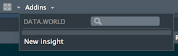
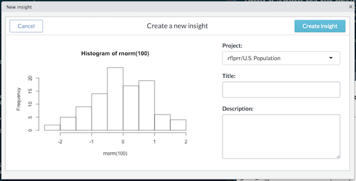

```{r, echo = FALSE}
NOT_CRAN <- identical(tolower(Sys.getenv("NOT_CRAN")), "true")
CONFIGURED <- !is.null(getOption("dw.auth_token"))
knitr::opts_chunk$set(
  collapse = FALSE,
  comment = "##",
  purl = NOT_CRAN && CONFIGURED,
  eval = NOT_CRAN && CONFIGURED
)
```

## Configuration

This package requires a valid API auth token to work.  
Configuration can be provided in 3 forms:

* Via config file
* Via environment variables
* At runtime

Config files are the most convenient configuration method. Once saved
configuration will be automatically restored when `data.world` is loaded.

From the R console:
```{r configure, eval = FALSE}
saved_cfg <- data.world::save_config("YOUR API TOKEN")
data.world::set_config(saved_cfg)
```

To obtain your API token, visit: https://data.world/settings/advanced
For additional configuration options, see `?set_config`

### DO NOT SHARE YOUR AUTHENTICATION TOKEN

For your security, do not include your API authentication token in code that
is intended to be shared with others.

## Pulling data

Use the data.world package to retrieve data from the site using SQL or SPARQL.

Here is an example:
```{r SQL}
intro_ds <- "https://data.world/jonloyens/an-intro-to-dataworld-dataset"
team_df <- data.world::query(
  data.world::qry_sql("SELECT * FROM DataDotWorldBBallTeam"),
  dataset = intro_ds
)

team_df
```

For additional examples, including parameterized queries and SPARQL, 
see `query` vignette.

## Publishing Insights

For your convenience, this package allows you to publish
[insights](https://meta.data.world/showcasing-your-data-work-using-insights-9c578698275b) 
to 
[data projects](https://meta.data.world/introducing-data-projects-e7cfa971b552)
without leaving R Studio.

Using R Studio's "Addins" menu, look for `DATA.WORLD > New insight`. 



The add-in will automatically capture the active plot in R Studio's plot 
view and give you the opportunity to quickly choose the project, and enter 
title and description for your insight.



## data.world REST API

The `dwapi` package simplifies access to data.world REST APIs. 
`dwapi` is bundled and automatically loaded with `data.world`. Using it 
you can create and update datasets, upload data and update metadata, among other things.

For example, to get the definitions of a dataset, you can:
```{r get_dataset}
intro_def <- dwapi::get_dataset(intro_ds)
intro_def$description
```

To learn more about data.world's REST API, checkout 
https://docs.data.world/documentation/api and `?dwapi`.

